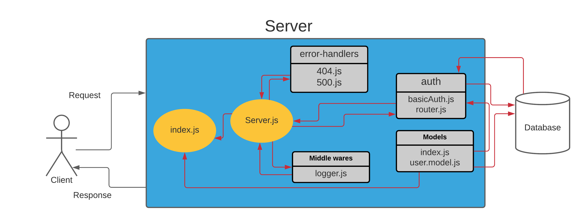

# basic-auth

- Authentication System Phase 1: Deploy an Express server that implements Basic Authentication, with signup and signin capabilities, using a Postgres database for storage.

---

## How to Build?

1. Create a new repo and go to action then select node.js workflow for CI.

2. Clone it to your local machine and create Package.json and add server.js and index.js.

3. Install the backages.

4. follow the design pattern in the repo and write your own code.

**important note ❗**: You should follow the structure for testing purposes and best practices.

---

## Links

---

## UML 

